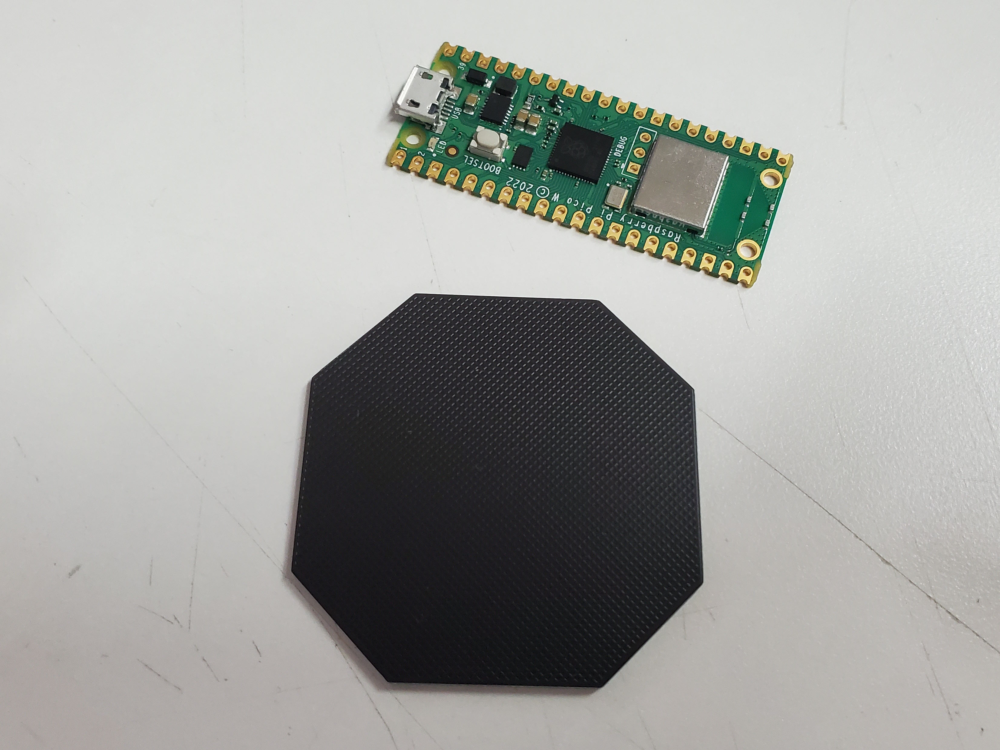
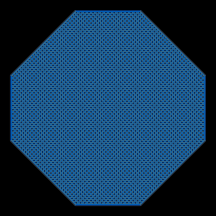
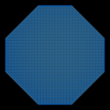

# Token

I was bored one day, so I made this... not sure what'll do with it... get the PCB manufactured, laser cut design into it, use in game or something...

Photo of the board with a [pico-w](https://www.raspberrypi.com/documentation/microcontrollers/raspberry-pi-pico.html) next to it (for scale).

## Licence

Copyright © 2022 Phil Baldwin

This work is licensed under a Creative Commons Attribution-ShareAlike 4.0 International License.

You should have received a copy of the license along with this work. If not, see <http://creativecommons.org/licenses/by-sa/4.0/>.
